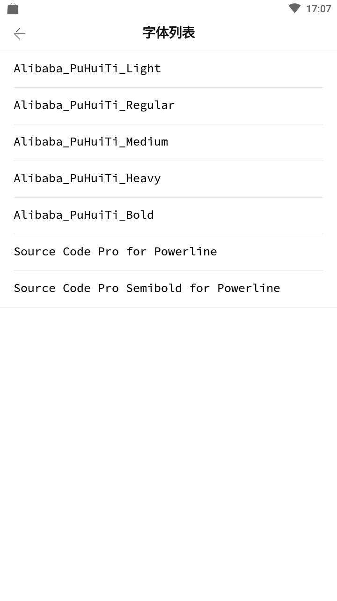
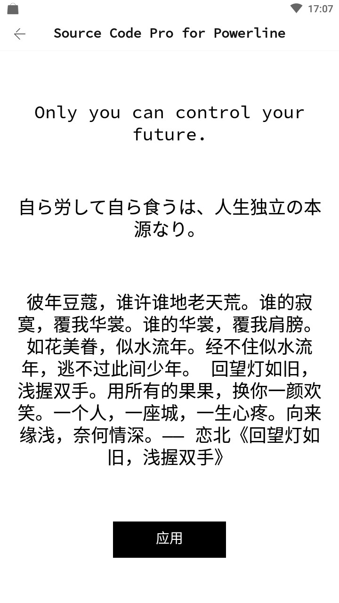

# Android-Font-Config
使用`kotlin`开发的一个字体配置库






### 引用
只使用`api`（里面包含`SharedPreference`保存信息的实现）：
```
implementation("com.fpliu:Android-Font-Config-api")
```
使用[MMKV](https://github.com/Tencent/MMKV)的实现：
```
implementation("com.fpliu:Android-Font-Config-impl-mmkv")
```

### 使用
在`Application.onCreate()`中应用字体：
```
//如果要使用MMKV保存信息的话，需要设置下面的这句代码，默认使用SharedPreference保存信息
FontConfigFactory.setInstance(FontConfigViaMMKV(this))

try {
    applyFontFromConfig("assets:Alibaba_PuHuiTi_Light.otf")
} catch (e: Exception) {
    e.printStackTrace()
}
```
传入的参数是默认的字体的`uri`，`uri = type:path`，`type`支持`assets`和`file`两种。


如果只是设置死某个字体，不需要让用户选择用哪个字体的话，
设置成如下：
```
try {
    applyFont("assets:Alibaba_PuHuiTi_Light.otf")
} catch (e: Exception) {
    e.printStackTrace()
}
```


### 用到的第三方库
1. [RxJava2](https://github.com/ReactiveX/RxJava)
2. [RxAndroid](https://github.com/ReactiveX/RxAndroid)
3. [RxBinding](https://github.com/JakeWharton/RxBinding)
4. [OKHTTP](https://github.com/square/okhttp)
5. [Retrofit](https://github.com/square/retrofit)
6. [GSON](https://github.com/google/gson)
7. [AutoDispose](https://github.com/uber/AutoDispose)
8. [MMKV](https://github.com/Tencent/MMKV)
9. [友盟统计](https://jcenter.bintray.com/com/umeng/)

### 用到的工具
1. [Walle](https://github.com/Meituan-Dianping/walle) 
2. [LeakCanary](https://github.com/square/leakcanary)
3. [AndResGuard](https://github.com/shwenzhang/AndResGuard)
4. [ProGuard](http://blog.fpliu.com/it/software/ProGuard)
5. [ReDex](http://blog.fpliu.com/it/software/ReDex)
6. [360加固包](http://blog.fpliu.com/it/software/360加固保)
7. [libwebp](http://blog.fpliu.com/it/software/libwebp)
8. [7zip](http://blog.fpliu.com/it/software/p7zip)
9. [Bash](http://blog.fpliu.com/it/software/GNU/Bash)

### 打印日志
```
adb logcat | grep "VP_"
```

### 查看崩溃日志
```
adb shell cat /sdcard/com.fpliu.newton.font.config.sample/log/UncaughtException.log
```

### 构建包
构建`release`包：
```
./tool.sh build release --webp --jiagu --resguard --channel
```
构建`debug`包：
```
./tool.sh build debug
```
